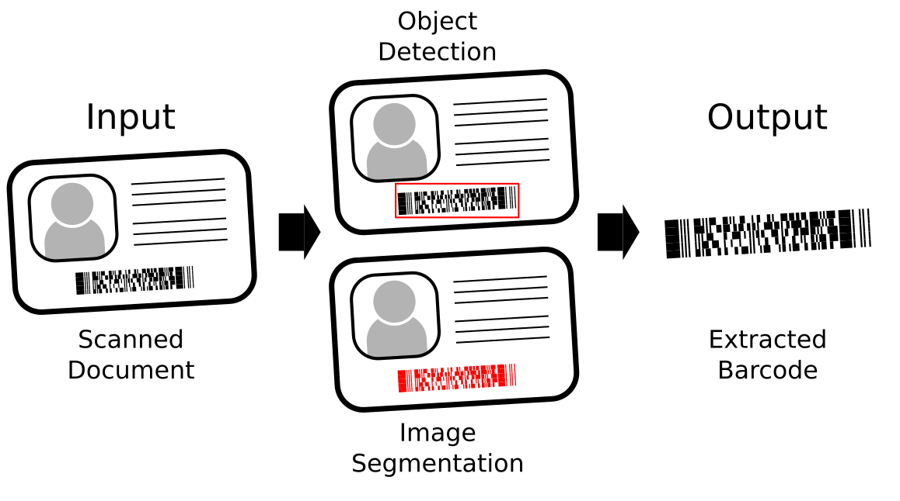

# barberchop
Segments, classifies and extracts barcode images from larger images containing one or more barcodes.

## Overview

Barberchop is a library for detecting and extracting barcodes from images using neural networks trained for object detection or segmentation. Once these barcodes are extracted they can then be passed along to other libraries for image enhancement and decoding.

## How It Works

Barberchop uses the custom trained models using datasets of images with barcodes in them.



## Installation

Use the package manager [pip](https://pip.pypa.io/en/stable/) to install barberchop.

```bash
pip install barberchop
```

## Usage

```python
import cv2
from Barberchop.ExtractionService import BarberchopYoloService

service = BarberchopYoloService()
img = cv2.imread('barberchop/src/test.png')
results = service.extract(img)

print(f"Found {len(results)} barcodes")
for barcode in results:
    cv2.imshow("barcode", barcode.image)
    cv2.waitKey(1000)
```

## Roadmap

- [X] Object Detection based Extraction using Yolov5
- [ ] Image Segmentation based Extraction

## Contributing
Pull requests are welcome. For major changes, please open an issue first to discuss what you would like to change.

## License
**MIT**

Copyright 2021 Sparkfish LLC

Permission is hereby granted, free of charge, to any person obtaining a copy of this software and associated documentation files (the "Software"), to deal in the Software without restriction, including without limitation the rights to use, copy, modify, merge, publish, distribute, sublicense, and/or sell copies of the Software, and to permit persons to whom the Software is furnished to do so, subject to the following conditions:

The above copyright notice and this permission notice shall be included in all copies or substantial portions of the Software.

THE SOFTWARE IS PROVIDED "AS IS", WITHOUT WARRANTY OF ANY KIND, EXPRESS OR IMPLIED, INCLUDING BUT NOT LIMITED TO THE WARRANTIES OF MERCHANTABILITY, FITNESS FOR A PARTICULAR PURPOSE AND NONINFRINGEMENT. IN NO EVENT SHALL THE AUTHORS OR COPYRIGHT HOLDERS BE LIABLE FOR ANY CLAIM, DAMAGES OR OTHER LIABILITY, WHETHER IN AN ACTION OF CONTRACT, TORT OR OTHERWISE, ARISING FROM, OUT OF OR IN CONNECTION WITH THE SOFTWARE OR THE USE OR OTHER DEALINGS IN THE SOFTWARE.
